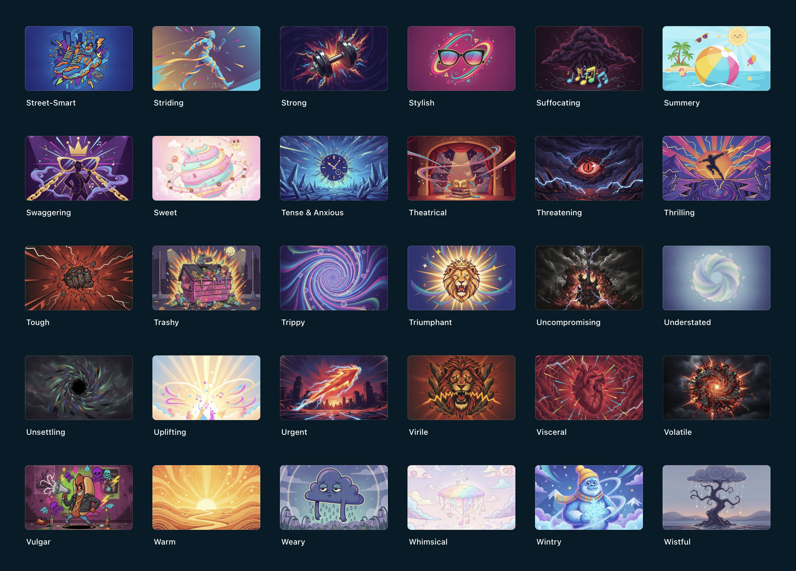

# Chromatix Assets<!-- omit in toc -->

Chromatix is a desktop music player for Plex, that transforms your listening experience and makes interacting with your music libraries a joy.

Get started at [https://chromatix.app/](https://chromatix.app/)

This repo contains image assets for Chromatix - specifically, images for tags (genres, moods, styles, etc.). It also includes an optional script for batch generating new tag images with AI using the Gemini API.

This repo does not contain source code for the Chromatix web app itself - that is a separate repo which can be found [here](https://github.com/chromatix-app/chromatix-app).

# Table of contents<!-- omit in toc -->

- [1. About this repo](#1-about-this-repo)
- [2. Contributing images](#2-contributing-images)
- [3. Generating new tag images with Gemini](#3-generating-new-tag-images-with-gemini)
  - [3.1. Install dependencies](#31-install-dependencies)
  - [3.2. Set up your Gemini API key](#32-set-up-your-gemini-api-key)
  - [3.3. Run the generator](#33-run-the-generator)
- [4. Deploying](#4-deploying)
- [5. Other scripts](#5-other-scripts)
- [6. Examples](#6-examples)
  - [6.1. Good examples](#61-good-examples)
  - [6.2. Bad examples](#62-bad-examples)

# 1. About this repo

When browsing your music library in Chromatix, you can browse by tags such as genres, moods, and styles. This repo contains the thumbnail images for those tags, which are stored in `assets/tags/community/` and served from [https://assets.chromatix.app/](https://assets.chromatix.app/).

Tags are essentially unlimited as people can tag items however they want, but anonymised usage data has allowed most tags in use to be collated here in `data/tags.json`. Some tags are already very niche, bizarre, or badly formatted, but they're taken from legitimate usage of the app.

The sheer number of tags made manual curation unfeasible, but batch-generated AI images are a practical alternative. That does mean lots of the images are poor quality, but the goal is to have something for every tag.

This repo is open for the community to contribute to improving the images. Submitted images can be created manually, via the bundled generator, or however else you like.

The images from this repo will be rolled out to the Chromatix app in a future release. They will be an entirely optional opt-in feature, although may become opt-out later on.

Example of some of the images in use in the app:



# 2. Contributing images

Image contributions are welcome! For now, contributions are limited to replacing or adding images in `assets/tags/community/` — please don't submit changes to `data/tags.json` or any code, those aren't open for contribution at this time.

To contribute:

1. Fork this repo.
2. Add or replace one or more images in `assets/tags/community/`. The filename must match the existing slug for that tag (see `data/tags.json` for the list of tag names, and `lib/slugifyTagName.ts` for how a tag name maps to its filename).
3. Make sure each image meets the project spec:
   - **500x300px**, exactly.
   - **`.jpg` format**.
   - **Compressed** — ideally run through something like [tinypng.com](https://tinypng.com/) before submitting.
4. Open a pull request with your changes.

# 3. Generating new tag images with Gemini

## 3.1. Install dependencies

```bash
npm install
```

## 3.2. Set up your Gemini API key

```bash
cp .env.sample .env.local
```

Then add your Gemini API key to `.env.local`:

```
GEMINI_API_KEY=YourGeminiAPIKey
```

Get a key at [aistudio.google.com/apikey](https://aistudio.google.com/apikey).

## 3.3. Run the generator

```bash
npm run tags:generate
```

Reads tag names from `data/tags.json` and generates a thumbnail for any tag that doesn't already have one in
`assets/tags/community/`. Already-generated tags are always skipped, so it's safe to re-run at any time to pick up
anything missing from a previous run (e.g. after adding new tags, or if a request failed).

All generator config — the AI prompt, output dimensions, reference image folders, rate limiting, etc. — lives in the
`CONFIG` block at the top of `lib/tagImageGenerator.ts`.

# 4. Deploying

This repo deploys to Vercel as a static site (no build step). `vercel.json` and `.vercelignore` scope the deploy to
just `assets/` and `data/tags.json`, so once deployed, assets and the tags list are reachable at:

```
https://assets.chromatix.app/assets/tags/community/<slug>.jpg
https://assets.chromatix.app/data/tags.json
```

# 5. Other scripts

- `npm run knip` — run [knip](https://knip.dev/)
- `npm run lint` / `npm run lint:fix` — ESLint
- `npm run prettier` / `npm run prettier:fix` — Prettier
- `npm run typecheck` — TypeScript, no emit
- `npm run check` — knip + lint + prettier + typecheck

# 6. Examples

Some of the generated images are good. Some are ok. Many are terrible. Most are purple for some reason.

The main goal is to have a set of good and somewhat consistent images for every tag. Preferably fairly simple and identifiable at a glance, with a good variety of different colours used as appropriate. Below are some examples of the better ones, and some of the worst ones, to give a sense of the aims and the current state of the generator.

## 6.1. Good examples

## 6.2. Bad examples
